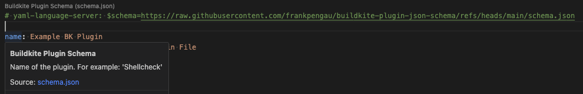

# Buildkite Plugin JSON Schema

A JSON Schema for validating buidlkite plugin YAML files. 

Based on Buildkite's plugin linter YAML file: https://github.com/buildkite-plugins/buildkite-plugin-linter/blob/master/lib/plugin-yaml-schema.yml

## Purpose

To replicate what Buildkite's Pipeline Schema is doing for Buildkite pipeline files but for Buildkite Plugin files. 

Ref: 
- https://github.com/buildkite/pipeline-schema/blob/main/schema.json


## Usage

If using Red Hat YAML VSCode Extension (`redhat.vscode-yaml`), put a comment line at top of the `plugin.yml` file: 
```
# yaml-language-server: $schema=https://raw.githubusercontent.com/frankpengau/buildkite-plugin-json-schema/refs/heads/main/schema.json
```

Example:
```
# yaml-language-server: $schema=https://raw.githubusercontent.com/frankpengau/buildkite-plugin-json-schema/refs/heads/main/schema.json

name: Example BK Plugin
description: An Example Buildkite Plugin File
author: example-group
requirements:
  - docker
configuration:
  properties:
    command:
      type: string
    required:
      - command
    additionalProperties: false
```

When hovered over, it should show the prompt and the schema associated to it:
